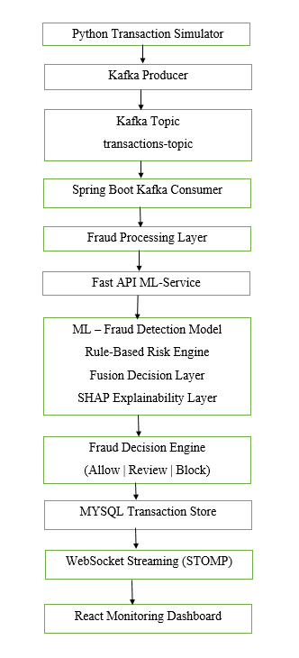
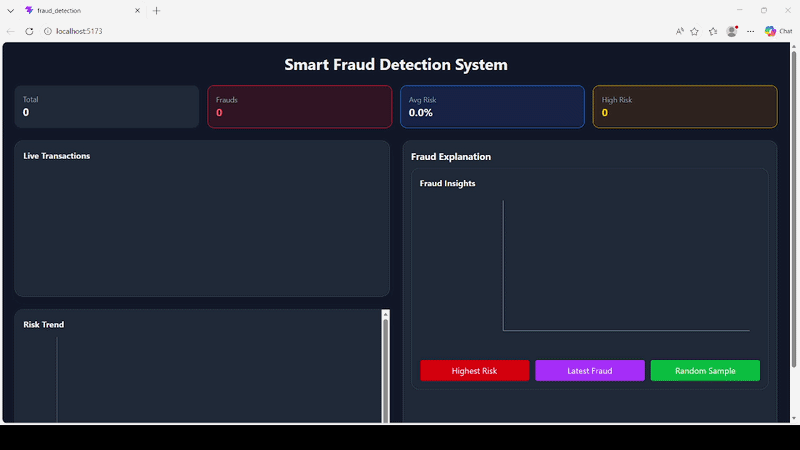

# Smart Fraud Detection System

A **real-time, explainable fraud detection platform** built using a distributed architecture that combines **Machine Learning, Rule-Based Intelligence, and SHAP Explicability** to detect and analyze fraudulent financial transactions instantly.

The system simulates live banking transactions, evaluates risk in real time, and provides **transparent AI-driven explanations** for every fraud decision.

---

## Key Features

### Real-Time Fraud Detection

- Live transaction streaming using Apache Kafka
- Event-driven fraud processing pipeline
- Real-time ML fraud scoring
- Instant fraud decisioning (`ALLOW | REVIEW | BLOCK`)
- Continuous WebSocket-based dashboard updates
- Low-latency distributed processing architecture

### Hybrid Intelligence Engine

Combines:

- Machine Learning model (probabilistic fraud scoring)
- Rule-based fraud detection engine
- Fusion logic for final decision making

> Ensures both statistical learning and domain logic are used together for higher accuracy.

---

### Explainable AI (XAI) with SHAP

- Feature-level explanation for every prediction
- Shows **impact of each transaction attribute**
- Helps understand *why a transaction was flagged*

Example insights:

- High transaction amount
- Balance anomaly
- Suspicious transfer pattern

---

### Live Fraud Monitoring Dashboard

Built with React, featuring:

- Live transaction feed
- Risk trend visualization
- Fraud summary insights
- Rule trigger breakdown
- Drill-down investigation mode (SHAP analysis)

---

### Smart Investigation System

Instead of manual selection, users can inspect:

- Highest Risk Transaction
- Latest Fraud Case
- Random Sample Review

Each triggers:

- Transaction selection
- ML + Rule explanation
- SHAP-based feature attribution

---

## System Architecture

---

## Tech Stack

### Streaming & Messaging

- Apache Kafka
- Event-driven architecture
- Kafka Producer / Consumer pipeline

### Backend

- Java Spring Boot
- Spring Kafka
- Spring WebSocket (STOMP)
- REST APIs

### ML Service

- Python FastAPI
- Scikit-learn / XGBoost (model)
- SHAP (Explainable AI)
- NumPy / Pandas

### Frontend

- React.js
- Tailwind CSS
- Recharts (visualization)
- SockJS + STOMP client

### Database

- MySQL

### Simulation Engine

- Python transaction generator
- Realistic fraud pattern simulation
- Burst + anomaly-based streaming generation

---

## Fraud Detection Logic

### ML Model

Predicts fraud probability using transaction features:

- Amount
- Balance changes
- Transaction type
- Engineered financial features

---

### Rule Engine

Enhances detection using domain logic:

- High transaction amount threshold
- Balance anomaly detection
- Suspicious transfer patterns
- Rapid account draining behavior

---

### Fusion Strategy

If rule score >= threshold → BLOCK
Else → max(ML score, rule score)
Decision → ALLOW | REVIEW | BLOCK

## Feature Engineering

The model is enhanced with engineered features:

- Balance difference
- Account drain detection
- Zero balance indicator
- Amount-to-balance ratio
- Destination balance changes

---

## Fraud Simulation Engine

A custom generator creates realistic transaction streams:

- Normal + fraudulent behavior mix
- Burst transaction patterns
- Randomized financial behavior
- Real-time streaming simulation

---
---

## Kafka Streaming Pipeline

The system uses Apache Kafka as a real-time event streaming platform.

### Streaming Flow

Python Simulator
    ↓
Kafka Producer
    ↓
transactions-topic
    ↓
Spring Boot Kafka Consumer
    ↓
Fraud Detection Pipeline

## Project Demo

---

## Key Highlights

- Real-time distributed fraud detection system
- Apache Kafka event streaming integration
- Hybrid ML + rule-based intelligence engine
- Explainable AI using SHAP
- Event-driven microservice-style architecture
- Live WebSocket transaction monitoring
- Real-time fraud simulation engine
- Dockerized streaming infrastructure
- Production-inspired system design

---
---

## Running the Project

### Start Kafka

docker compose up

### Start Backend

mvn spring-boot:run

### Start Ml Service

uvicorn app:app --reload

### Start Frontend

npm run dev

### Start python Transaction Simulator

python simulate.py

## What Makes This Project Unique

Unlike traditional ML-based fraud detection projects, this platform:

- Processes transactions in real-time using Apache Kafka
- Uses event-driven streaming architecture
- Combines ML + rule-based fraud intelligence
- Provides explainable AI insights using SHAP
- Simulates production-style banking transaction streams
- Streams live fraud decisions to a monitoring dashboard
- Demonstrates distributed system communication patterns
- Uses asynchronous processing for scalability

---

## Future Enhancements

- User behavior profiling system
- Graph-based fraud detection (transaction networks)
- Real-time alerting system (email/SMS)
- Persistent fraud case management
- Advanced anomaly detection models

---

## Author

Built as a **full-stack AI system project** demonstrating:

- Machine Learning engineering
- Backend system design
- Real-time architecture
- Explainable AI integration

---

## Contributor

Ishika Jain
